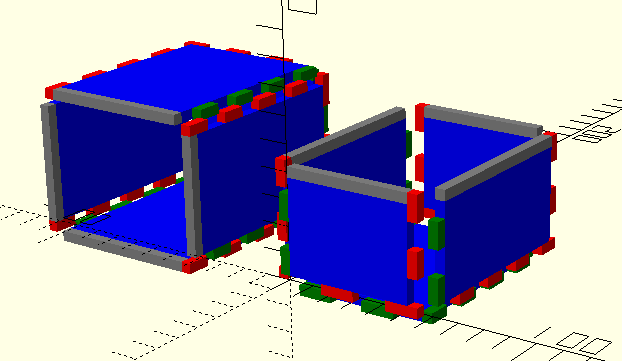

# Lasercut Boxes



Two lasercut boxes with joins.

## Utility

Create plate with joins 

```
mLaserCutPlate(
  $pLcpW     // wide
 ,$pLcpH     // height
 ,$pLcpT     // thickness
 ,$pLcpF1    // finger-1
 ,$pLcpF2    // finger-2
 ,$pLcpF3    // finger-3
 ,$pLcpF4    // finger-4
 ,$pLcpC=0.2 // cut gap (default 0.2mm)
 )
```

Create joins 

```
mLaserCutPlateJoin(
  $pLcpjW    // wide
 ,$pLcpjT    // thickness/height
 ,$pLcpjF    // fingers
 ,$pLcpjC    // cut gap
 )
```
join finger pattern 
* 0.5 ~ no joins (yellow)
* -0.5 ~ no joins / no corner (gray)
* 1..n ~ joins (red)
* -1..n ~ joins inverse (green)
