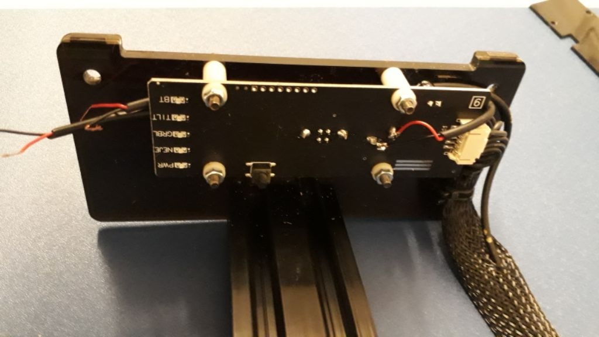

# Fan Holder for NEJE Master 2

* Fan Holder
* Board Holder
* ATtiny85 Controller
* Arduino Firmware

## Fan Holder

* 135 x 55 x 4 mm Plywood lasercut or 3D printed
* speed 15ms / power 100% / loops 8x / total 35 minutes
* [NejeMaster2-FanHolder.stl](NejeMaster2-FanHolder.stl) - 3D model printer
* [NejeMaster2-FanHolder-135x55mm.nc](NejeMaster2-FanHolder-135x55mm.nc) - 2D model laser cut

I designed this holder for a fan on the 20 Watt Laser NEJE Master 2.

Without a fan, the smoke from cutting wood etc. goes directly to the lens and the diode of the laser.

There are two versions of this model. The GCode for the CNC mode has holes 0.15mm smaller and the STL for the 3D printer has holes 1.0mm larger to get the real size you want.

## Board Holder

* 169 x 59 x 2 mm Plywood lasercut or 3D printed
* speed 50ms / power 100% / loops 2x / total 15 minutes
* ATtiny85 Digispark
* Push Button
* NPN-Transistor 2N2222
* Resistor 220 Ohm
* Diode N4001
* Capacitor 100uF 25V

Modified cover for the board of the laser cutter. Microcontroller with push button to control the fan speed and switch on/off.

Power supply via 12V connection with additional soldered cable.

## Arduino Firmware

Firmware to control the fan speed and switch on/off.

* push button = switch on/off
* press and hold for 2 seconds = next speed
* press and hold for 6 seconds = save speed

The fan is controlled with a modified PWM of 16 kHz. With normal PWM of 500 Hz, whistling sounds are produced by the fan. 

The clock of the microcontroller is reduced to 500 kHz to save energy. The quiescent current is 9 mA. At medium speed the consumption is approx. 90 mA with fan switched on.

