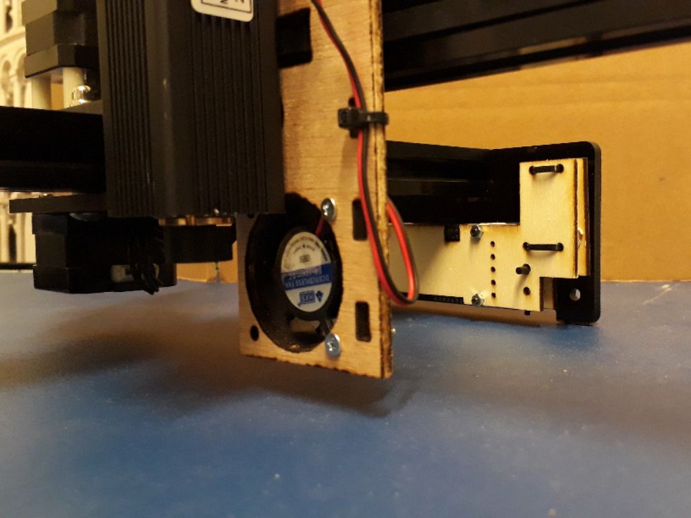
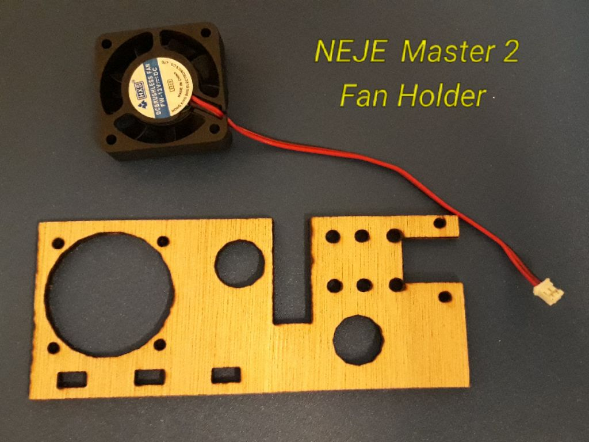
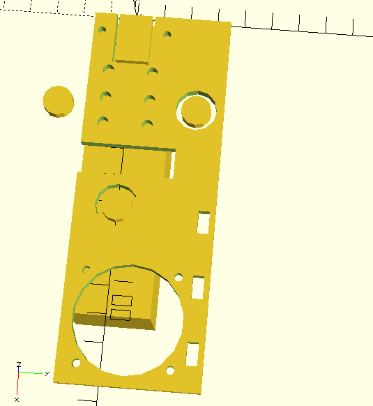
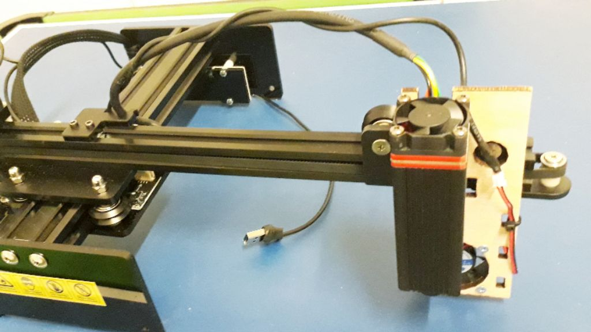
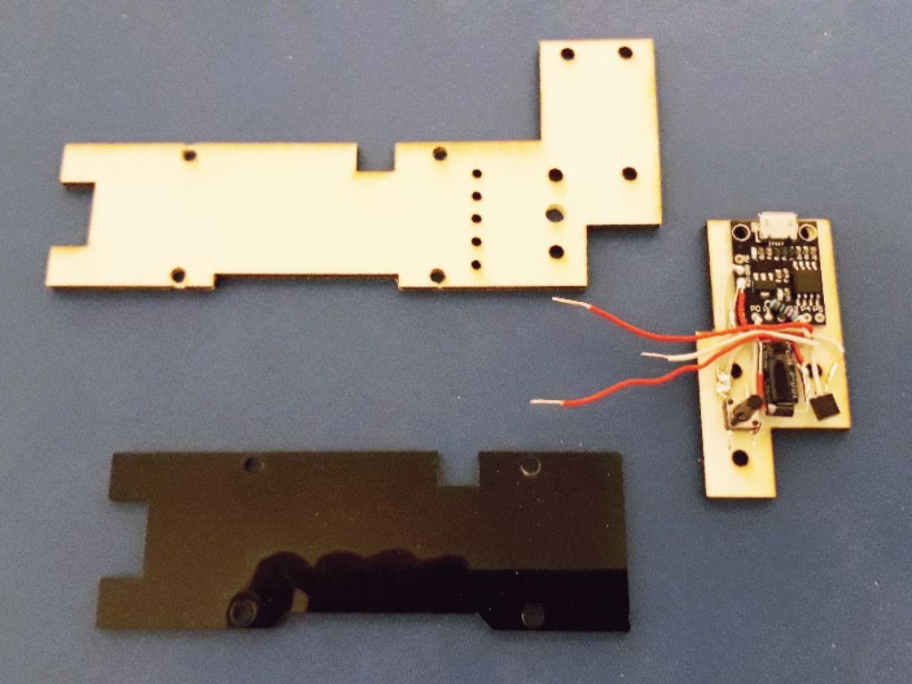

# Fan Holder for NEJE Master 2

* Fan Holder
* Board Holder
* ATtiny85 Controller
* Arduino Firmware

## Fan Holder

* 135 x 55 x 4 mm Plywood lasercut or 3D printed
* speed 15ms / power 100% / loops 8x / total 35 minutes
* [NejeMaster2-FanHolder.stl](NejeMaster2-FanHolder.stl) - 3D model printer
* [NejeMaster2-FanHolder-135x55mm.nc](NejeMaster2-FanHolder-135x55mm.nc) - 2D model laser cut

I designed this holder for a fan on the 20 Watt Laser NEJE Master 2.

Without a fan, the smoke from cutting wood etc. goes directly to the lens and the diode of the laser.

There are two versions of this model. The GCode for the CNC mode has holes 0.15mm smaller and the STL for the 3D printer has holes 1.0mm larger to get the real size you want.

## Board Holder

* ATtiny85 Digispark
* Push Button
* NPN-Transistor 2N2222
* Resistor 220 Ohm
* Diode N4001
* Capacitor 100uF 25V
