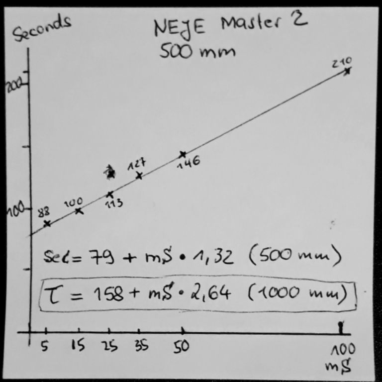
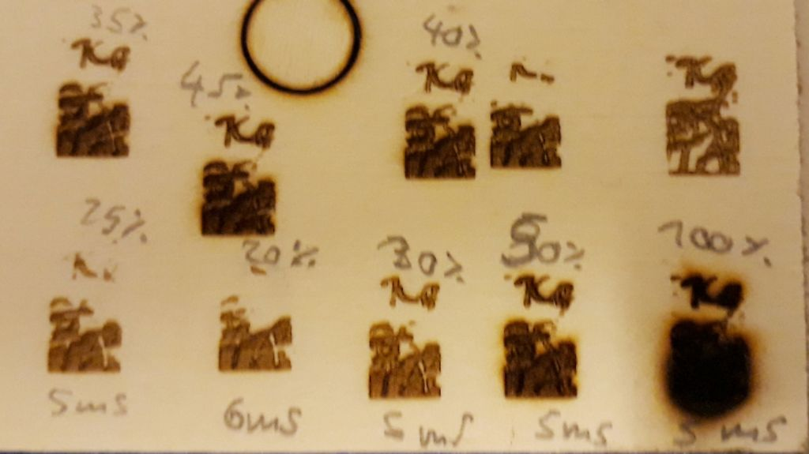

# NEJE Master 2

* Size max. 170 x 170 mm 
* Image max. 2266 x 2266 px
* 338 dpi (133.3 px/cm)
* reduce smoky smell with coffee powder

## Speed Test

My tests for a 500 mm laser cut show a correlation between burning time in mS and total processing time in seconds.

A double burning time in mS does not double the total duration in NEJE software!

Laser cutting of plywood with 25 mS burning time and 6 passes takes 678 seconds in total, but with 50 mS and 3 passes only 438 seconds.

NEJE recommendations: power 100% / burning time ...
* 20 ms = leather
* 30 ms = wood, bambo
* 30 ms = acrylic, bone, paint metal
* 40 ms = plastic
* 50 ms = rubber

## Test engrave playwood

* burning time 5ms, power 30% - light
* burning time 5ms, power 40% - good
* burning time 5ms, power 50% - dark

## Paper 

* carving time 5ms / laser power 80% = cut
* carving time 5ms / laser power 60% = engrave
* carving time 2ms / laser power 100% = nothing

## Plywood 

2.8 mm / 3 layers / soft
* carving time 15ms / laser power 100% / 2x loops = partly cut
* carving time 15ms / laser power 100% / 3x loops = cut
* carving time 45ms / laser power 100% / 1x loop = cut

3.8 mm / 3 layers / strong
* carving time 15ms / laser power 100% / 6x loops = partly cut
* carving time 15ms / laser power 100% / 7x loops = cut

## Acryl / Plexiglas

* good = PMMA (Polymethylmethacrylat)
* very good = PMMA "XT" (extrudiert)
* semi good = PMMA "GS" (gegossen) Toleranze 
* bad = PE (Polyethylene) verformte Kanten
* bad = Polystyrol
* never = PVC (Polyvinylchlorid) Chlor + Salzsäure

3mm Acrylic (test tbd)

* black: carving time 2mm/s, laser power 100%, 3x loops, z -1.0mm = cut
* black: carving time 5mm/s, laser power 100%, 8x loops, z -1.0mm = cut
* orange: carving time 2mm/s, laser power 100%, 12x loops, z -1.0mm = cut
* green: carving time 2mm/s, laser power 100%, 16x loops, z -1.0mm = cut
* blue: carving time 2mm/s, laser power 100%, 16x loops, z -1.0mm = none

