# stencil font for laser cut

How to create a template for the Mini Laser Engraver.

## True Type Font

A special stencil font is required for cutting out the letters and numbers.
With a stencil font, all elements remain connected to the overall model via small bridges.

You can find free fonts on the Internet by searching for "free stencil font":
https://www.1001fonts.com/stenciled-fonts.html?page=3&items=10

## Create 2D model

Only the outer edges may be cut for the Laser Cutter.
OpenSCAD can be used to determine the outer edges of text and graphics. 

The result is exported in DXF file format.

## Convert DXF to PNG

The DXF format describes the outer edges for the Laser Cutter.
For the cheap Laser Engraver DXF must be converted to PNG.

## Laser cut

Cutting from paper or foam rubber requires maximum power and contrast.

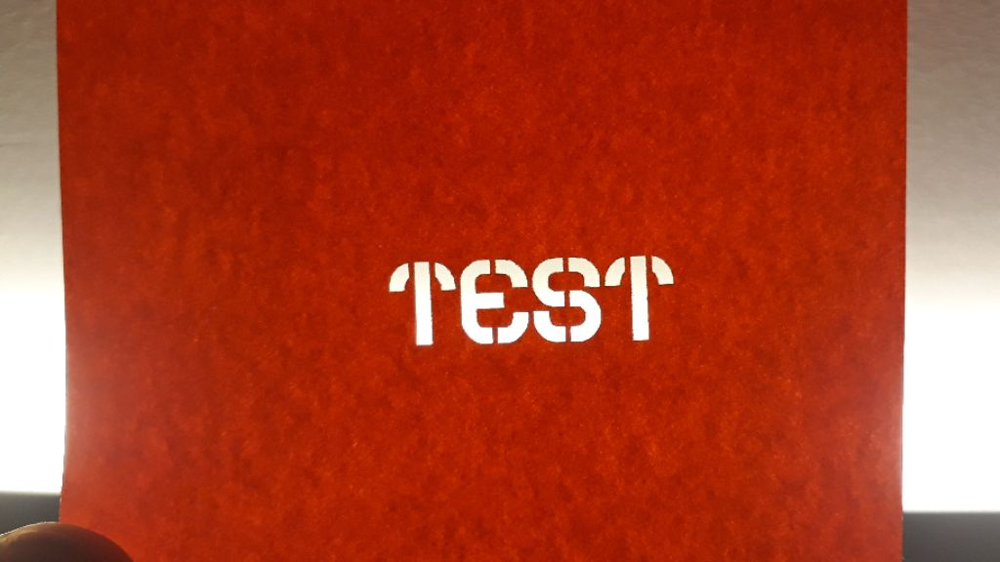

## Stencil Fonts

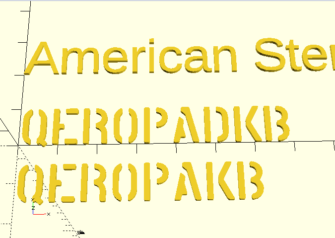
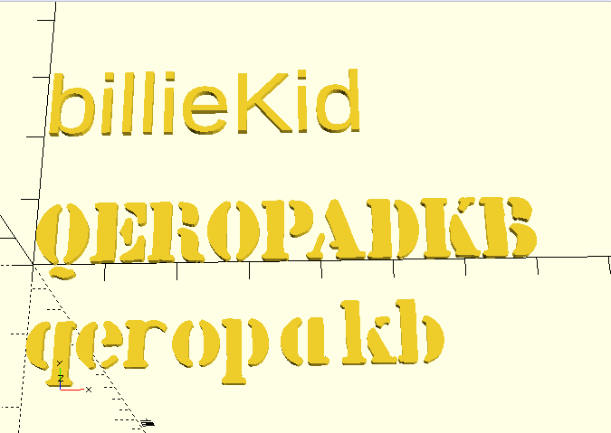
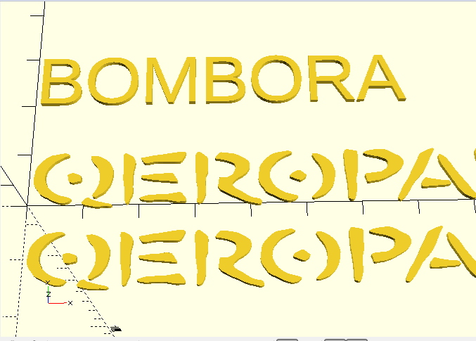
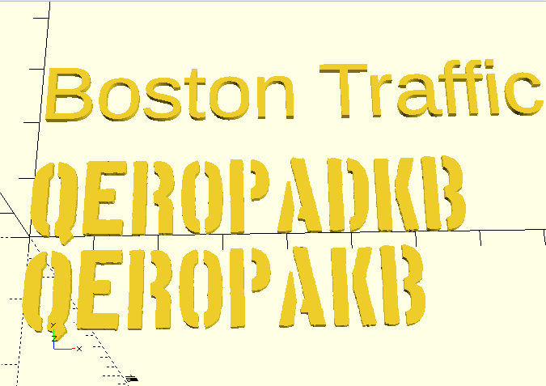
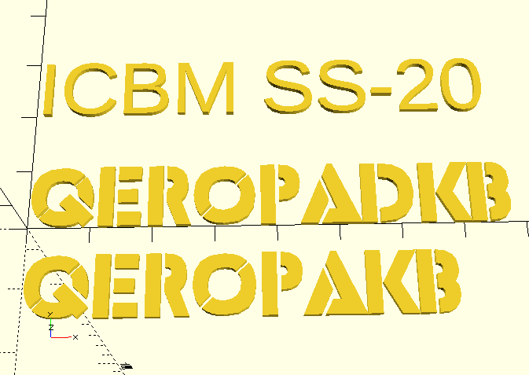
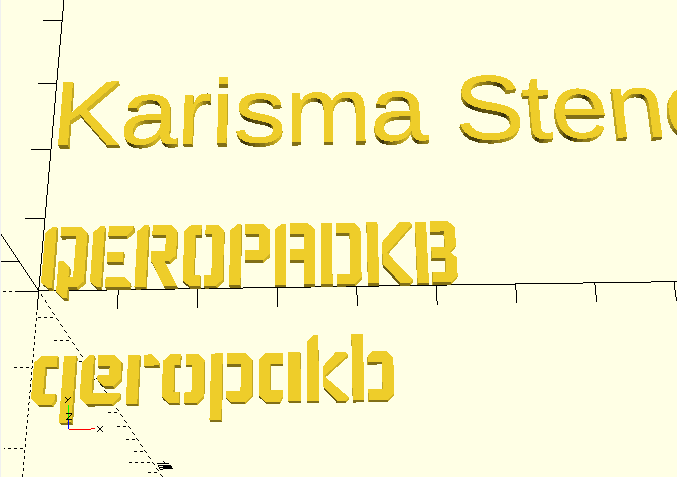
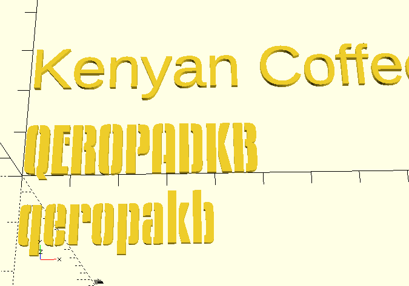
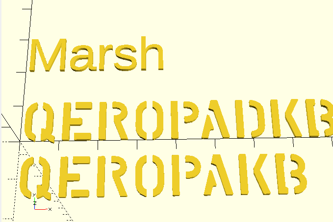
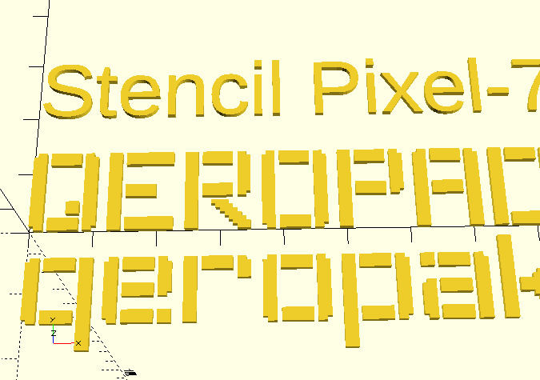
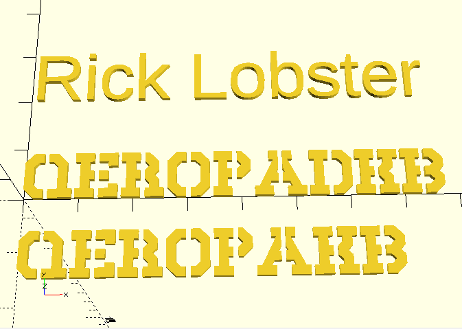
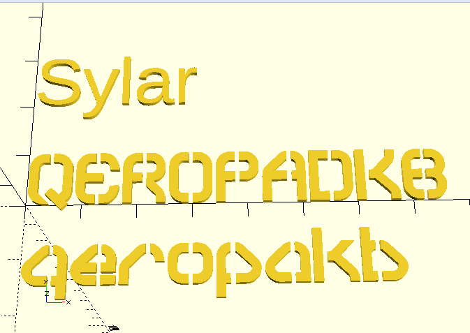
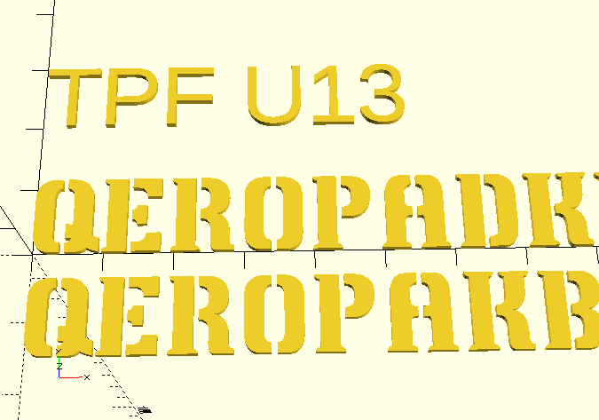
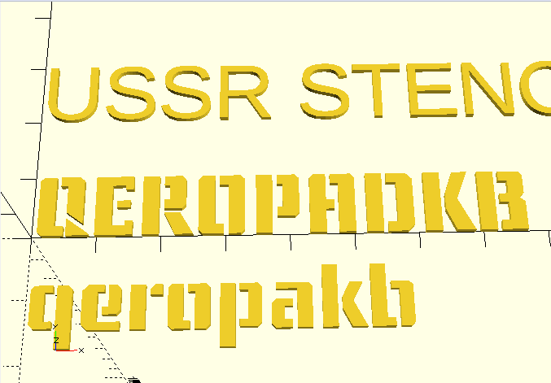
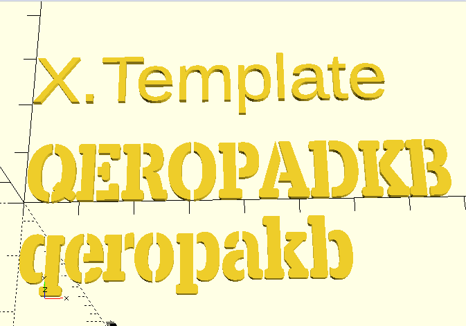
